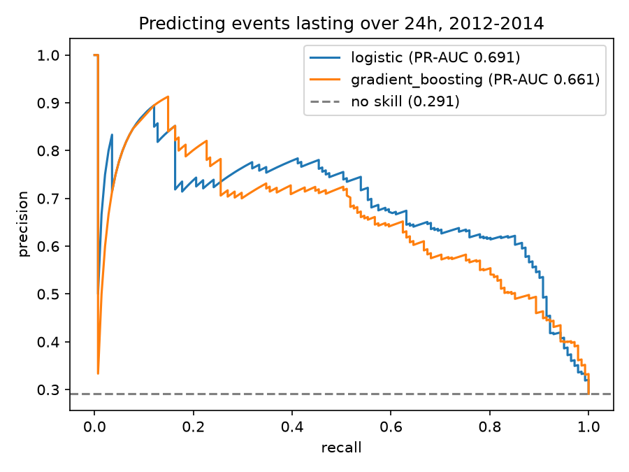
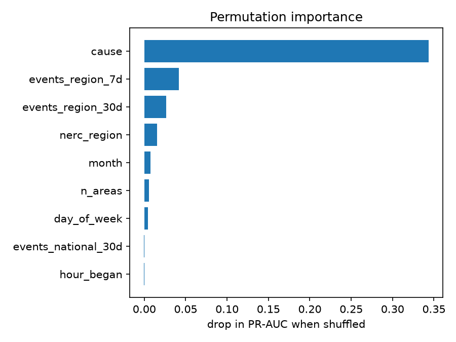
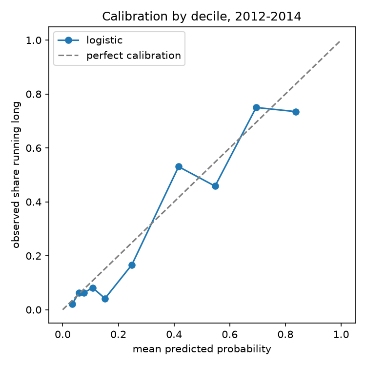

# outage-duration-prediction

**When a grid disturbance is first reported, can you tell whether it will still be unresolved 24 hours later?**

That's a crew-allocation question. A disturbance resolved inside a shift is routine; one
that runs past a day becomes a multi-day mutual-aid problem with different staffing,
different logistics, and a different conversation with the regulator. Knowing which is
which at the moment the report comes in is worth something.

This is prediction, not causal inference. Nothing here claims a cause *makes* an event
run long — only that what's known at the moment of reporting is informative about how
long restoration takes.

---

## Data

**DOE OE-417 Electric Disturbance Events, 2000–2014.** Every disturbance US utilities
are federally required to report: 1,652 events with cause, geography, NERC region, start
time and restoration time. Committed at `data/grid_disruption_2000_2014.csv.gz` (54 KB) —
no downloads, no API keys, the pipeline runs offline.

After dropping 48 events with no restoration time recorded and 29 with a negative or
30-day-plus duration (data entry errors), **1,575 events** remain.

| | |
| --- | --- |
| median restoration | 10.8 hours |
| 75th percentile | 48.5 hours |
| 90th percentile | 113.3 hours |
| train (2000–2011) | 1,091 events, 44.8% long |
| test (2012–2014) | 484 events, 29.1% long |

---

## How to run

```bash
python -m venv .venv && source .venv/bin/activate
pip install -r requirements.txt
./run_all.sh
```

Takes under a minute. `run_all.sh` builds the dataset, trains and evaluates all three
models, and rewrites the results table below from what the code actually produced.

---

## Method

### Target

A **long event** is one still unresolved 24 hours after it began. The threshold sits
above the median (10.8h) and below the 75th percentile (48.5h), so both classes are well
populated, and it maps to a real operational boundary rather than a quantile chosen for
neatness.

### Features

Nine features, all knowable the moment an event is first reported:

| feature | why |
| --- | --- |
| `cause` | storm, attack, equipment, fire, heat/demand, fuel supply, system operations, other — bucketed by keyword from free text |
| `nerc_region` | regional differences in terrain, weather and restoration practice |
| `month`, `day_of_week`, `hour_began` | season, and whether an overnight start delays crews |
| `n_areas` | how many places the report names — a rough proxy for breadth |
| `events_region_7d`, `events_region_30d` | disturbances already reported in this NERC region — crews and mutual aid are finite, so a region already busy may restore more slowly |
| `events_national_30d` | the same idea nationwide |

The rolling counts use `closed="left"`, so an event never counts itself and never sees
anything that happened after it.

### Two columns deliberately left out

`Number of Customers Affected` and `Demand Loss (MW)` are the strongest-looking
predictors in the file, and they're excluded on purpose. In OE-417 they're the *final*
figures, filed after restoration — not initial estimates. A model using them to predict
restoration time would be reading part of the answer, and it would fall apart in
deployment, where at the moment of reporting nobody knows the final customer count yet.

Leaving them in would have produced better numbers and a worse model.

### Validation

**Train on 2000–2011, test on 2012–2014. The split is by date, never random.**

Grid disturbances cluster: one storm system produces several reports from several
utilities within days. A random split would scatter siblings across training and test,
and the model would be scored on events it had effectively already seen. Splitting by
year is also the only version matching how it would be used — fit on history, score the
event now on the desk.

### Models

1. **Baseline** — always predict "not long."
2. **Logistic regression** — scaled numerics, one-hot categoricals.
3. **Gradient boosting** — histogram-based, 300 iterations, depth 3.

The operating threshold isn't 0.5. It's set so each model flags the same share of events
that the training years actually ran long, otherwise the threshold just encodes the class
balance.

### Metrics

**Accuracy is reported only to show why it's the wrong metric.** The baseline that
predicts nothing scores 70.9%, because 70.9% of test events aren't long. Any metric a
do-nothing model can win that convincingly is not measuring skill.

What's reported instead: precision and recall at the operating threshold; **PR-AUC**,
where no-skill is the base rate (0.291) rather than 0.5; and **precision@k**, because *k*
is a staffing budget — of the k events you'd pre-stage crews for, how many really ran
long.

---

## Results

Test years 2012–2014, 484 events, 141 of them long.

<!-- RESULTS:START -->

| model | accuracy | precision | recall | PR-AUC | ROC-AUC | P@10 | P@25 | P@50 | P@100 |
| --- | --- | --- | --- | --- | --- | --- | --- | --- | --- |
| baseline (never long) | 0.709 | 0.000 | 0.000 | 0.291 | 0.500 | 0.291 | 0.291 | 0.291 | 0.291 |
| logistic regression | 0.800 | 0.669 | 0.617 | 0.691 | 0.858 | 0.800 | 0.840 | 0.740 | 0.740 |
| gradient boosting | 0.787 | 0.644 | 0.603 | 0.661 | 0.838 | 0.800 | 0.840 | 0.720 | 0.720 |

<!-- RESULTS:END -->



**Reading this honestly:**

- The baseline's 70.9% accuracy is the whole argument for not using accuracy. It never
  identifies a single long event, and PR-AUC puts it at 0.291 where the real models sit
  near 0.69.
- **Logistic regression beats gradient boosting** on every metric. With 1,091 training
  events and nine features, there isn't enough data for the boosted trees to earn their
  extra capacity. Reporting the simpler model as the winner is the honest outcome, not a
  failure to tune.
- **Precision@25 = 0.84.** Of the 25 events the model ranks most likely to run long, 21
  did. Picking 25 at random gets you 7. That's the number worth quoting to an operations
  team.
- Recall at the operating threshold is 0.617 — roughly a third of long events are missed.
  This ranks well; it does not catch everything.

### What matters

Permutation importance (drop in PR-AUC when a feature is shuffled):

| feature | importance |
| --- | --- |
| `cause` | 0.343 |
| `events_region_7d` | 0.042 |
| `events_region_30d` | 0.026 |
| `nerc_region` | 0.015 |
| `month` | 0.008 |



Cause dominates, and the per-cause breakdown shows why:

| cause | events | median hours | share running long |
| --- | --- | --- | --- |
| storm | 802 | 43.5 | 65% |
| fuel supply | 32 | 48.1 | 62% |
| heat/demand | 182 | 5.5 | 22% |
| attack | 338 | 0.5 | 7% |
| equipment | 45 | 3.0 | 7% |
| system operations | 103 | 1.5 | 3% |

Storms take 87× longer to resolve than physical attacks at the median. The model's core
insight is not subtle, which is a point in its favour: it's learning something a grid
operator would confirm.

The regional rolling counts earning second and third place is the more interesting
result — how busy a region has been over the past week carries real information beyond
the cause, consistent with finite crews and mutual-aid capacity.

### Calibration



Predictions are bucketed into deciles and mean predicted probability compared against the
observed share running long. The top decile predicts 0.837 and delivers 0.735; the bottom
predicts 0.034 and delivers 0.020. Ordering is close to monotonic, and the model is
**overconfident at the top end.**

That overconfidence has a specific cause worth stating: the base rate fell from 44.8% in
training to 29.1% in test. The model learned a world where nearly half of events ran long
and was tested on one where under a third did. The ranking survives this; the
probabilities don't, quite. In deployment you'd recalibrate on recent data rather than
trusting a 2011-vintage probability in 2014.

---

## Limitations

- **Only federally reportable events.** OE-417 captures disturbances above reporting
  thresholds — roughly 110 events a year nationwide. This says nothing about ordinary
  outages, which is most of what a utility actually handles.
- **The base rate moves.** 44.8% of training events ran long against 29.1% in test. Some
  of that is real change in grid operations; some is change in reporting practice. The
  data can't separate them, and it's why calibration drifts.
- **Causes are keyword-bucketed from free text.** 700+ distinct descriptions collapse into
  eight buckets by regular expression. "Electrical System Separation" caused by a storm
  gets labelled `system operations`, not `storm`. Some mislabelling is certain.
- **Restoration times are self-reported** by utilities with varying diligence, and 5% of
  events were dropped outright for missing or impossible values.
- **Geography is free text** — `"California"`, `"Northern and Central California"`,
  `"San Diego & Orange Counties"`. `n_areas` counts comma-separated fragments, which is
  crude; it cannot distinguish a large event from a verbosely described one.
- **No weather data.** Cause tells you a storm hit, not how severe it was. Joining
  archived weather to each event's location and date would likely be the single biggest
  improvement — it's the obvious next step, and it needs event geography resolved to
  coordinates first.
- **No asset or crew data.** Nothing about circuit age, vegetation management, or how many
  crews were actually available. The rolling event counts are a weak proxy for the last of
  these.
- **1,575 events.** Enough for these models; not enough for a complicated one, which is
  exactly what the logistic-beats-boosting result demonstrates.

---

## Repo layout

```
outage-duration-prediction/
├── config.py                    target, split, features, cause patterns
├── data/
│   └── grid_disruption_2000_2014.csv.gz    OE-417, committed
├── src/
│   ├── 01_build_dataset.py      clean, bucket causes, rolling counts, target
│   └── 02_train_evaluate.py     three models, metrics, calibration, figures
├── tools/
│   └── fill_results.py          rewrites the results table above
├── outputs/                     committed: every table and figure below
└── run_all.sh
```

| output | contents |
| --- | --- |
| `model_comparison.csv` | the results table |
| `precision_at_k.csv` | precision@k for every model and k |
| `calibration.csv` | decile calibration |
| `feature_importance.csv` | permutation importance |
| `cause_summary.csv` | events, median hours and long-rate per cause |
| `test_predictions.csv` | every test event scored, ranked worst-first |
| `figures/` | PR curve, calibration plot, importance bar |
